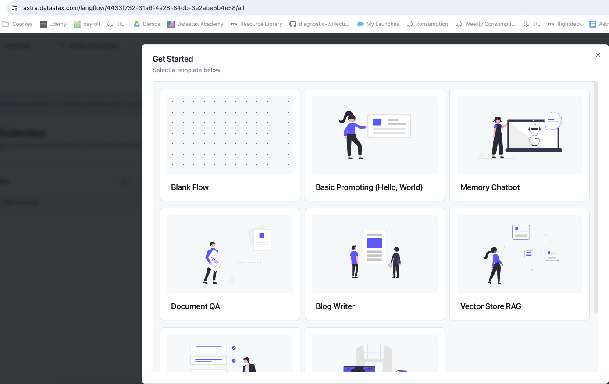

# Langflow and API Endpoint with Memory functionality

## Prerequisites
This application assumes you have access to:
1. [DataStax Astra DB](https://astra.datastax.com) (you can sign up through your Github account)
2. [OpenAI account](https://platform.openai.com/signup) (you can sign up through your Github account)

Follow the below steps and provide the **Astra DB API Endpoint**, **Astra DB ApplicationToken** and **OpenAI API Key** when required.

### Sign up for Astra DB
Make sure you have a vector-capable Astra database (get one for free at [astra.datastax.com](https://astra.datastax.com))
- You will be asked to provide the **API Endpoint** which can be found in the right pane underneath *Database details*.
- Ensure you have an **Application Token** for your database which can be created in the right pane underneath *Database details*.

### Sign up for OpenAI
- Create an [OpenAI account](https://platform.openai.com/signup) or [sign in](https://platform.openai.com/login).
- Navigate to the [API key page](https://platform.openai.com/account/api-keys) and create a new **Secret Key**, optionally naming the key.

## Build with Langflow

- If a collection has not yet been created in the Vector database, we need to create a test collection that we can use in this practice. To do this, simply select **Create Collection** from the Data Explorer tab as shown below.

    <p align="left">
    
    </p>

- In AstraUI at [astra.datastax.com](https://astra.datastax.com), click the **Build with Langflow** option as shown below.

- If you haven't started a project yet, you can use the RAG and Feedback Mechanism.json file, located in the [Langflow Directory](https://github.com/oktytncy/chatbot-that-can-learn-with-feedback/blob/main/langflow/RAG%20and%20Feedback%20Mechanism.json).

- To import the JSON file, click on **+ New Project** in the top right corner of the page, then choose **Blank Flow**.

    <p align="left"> </p>

    <p align="left"> </p>

- Next, select **Import** from the menu and upload the JSON file from the Langflow folder.

    <p align="left"> </p>

- This selection will load the architecture of the RAG application, ready for use.

    <p align="left"> </p>

- First, we make the necessary selections in the flow below to ingest the file we uploaded into the database we created.

    - **Path:** The path where the file to be loaded is located
    - **Model:** The OpenAI model on which the tests will be performed
    - **OpenAI API Key:** A unique identifier that allows users to access OpenAI's models through the API
    - **Collection:** The name of the AstraDB Collection
    - **Astra DB  Application Token:** Used to authenticate applications accessing the DataStax Astra database
    - **Database:** Vector database name
    - **Astra DB Chat Memory:** The database and collection you select here will be where the RAG application stores the data it learns through feedback. Therefore, it's recommended to use a separate collection to avoid modifying the main dataset. However, if you want to continuously update the main dataset, select the same database and collection.

    <p align="left"> </p>

- **Data Ingestion flow:** When we press the play button in the Astra DB box on the right, the data ingestion flow will start and the file we uploaded will be inserted into the Collection in the Database we defined. We can confirm this by going back to the AstraDB interface and checking the collection we created.

    <p align="left"> </p>

- Now, let's define the variables in the flow below and try asking a question to the document we added by typing *say something interesting* in the text field to see how the model reacts.

- If there's a green check mark in the upper right corner of the Chat Output box, as shown below, it means the flow has worked without any issues. 

    <p align="left"> </p>

- If we select the Playground option at the bottom left of the page, we can measure the reaction by asking more questions to the inserted data on the screen that appears.

- As shown in the example below, while the chatbot couldn't answer the question the first time, it was able to provide the correct answer the next time I asked, thanks to the feedback I provided.

    <p align="left"> </p>

- This answer isn't stored in memory; thanks to the Langflow we designed, the data has been inserted into the collection we defined for memory. Even if the session is interrupted or the data in memory is lost, the learned information will remain intact.

## Creating an Endpoint and Integrating Streamlit UI

After this step, we will call the created Langflow application using the API endpoint.

1. From the API selection at the bottom right of the page, we select the Python API, activate the Tweaks option, and then copy the Python code from there.

    - **Important :** Changed all True to true, False to false, and None to null, as required by JSON syntax.

    - **Example :**
        ```json
        {
        "ChatInput-uYIvw": {
            "files": "",
            "sender": "User",
            "sender_name": "User",
            "session_id": "",
            "should_store_message": true
        },
        "AstraVectorStoreComponent-84OZq": {
            "api_endpoint": "https://19e7aba0-88d0-4e5c-9b13-07019d95061a-us-east-2.apps.astra.datastax.com",
            "batch_size": null,
            "bulk_delete_concurrency": null,
            "bulk_insert_batch_concurrency": null,
            "bulk_insert_overwrite_concurrency": null,
            "collection_indexing_policy": "",
            "collection_name": "my_store",
            "metadata_indexing_exclude": "",
            "metadata_indexing_include": "",
            "metric": "",
            "namespace": "",
            "number_of_results": 4,
            "pre_delete_collection": false,
            ...
        ```

2.  You can optionally create a virtual environment. Virtual environments allow you to have a stable, reproducible, and portable environment. You control which package versions are installed and when they are upgraded.

- For more information, refer to: [How to create a Virtual Environment](https://github.com/oktytncy/build-rag-chatbot/blob/main/README.md#create-a-virtual-environment-optional)

3. Ensure You Have the Right Environment

    ```bash
    python --version
    ```

    or 

    ```bash
    python3 --version
    ```

- Install Required Libraries: If you haven't already, install the necessary libraries. Open a terminal and run:

    ```bash
    pip install requests argparse langflow
    ```

4. Prepare Your Script
    - By downloading this repo and adjusting the parameters in the [config.json](https://github.com/oktytncy/chatbot-that-can-learn-with-feedback/blob/main/conf/config.json) file, the application will be ready to run.
    - Relevant information can be copied from the Python API mentioned in step 1.

        - **Example:**
            ```json
            {
            "langflow_id": "83fb1d94-ce3c-.......",
            "flow_id": "853c4649-18fd-4fe2-......",
            "application_token": "AstraCS:......",
            "embedding_component_id": "OpenAIEmbeddings-....",
            "language_model_component_id": "ChatOpenAI-...."
            }
            ```

5. In order to perform streamlit integration, the necessary library must first be installed.

    ```python
    pip install streamlit
    ```

6. After setting up the necessary configurations and installing the required libraries, we can now run the application.

    ```python
    streamlit run app.py
    ```
    <p align="left"> </p>

### Summary

We built our RAG application with the memory feature using Langflow, transferred our file to the vector database, launched our application with a UI via the API endpoint and Streamlit, and asked our first question.

RAG applications may provide varying responses depending on the model, embeddings, and temperature. You can adjust the appropriate settings for your model, data, and use case at the session level on the left side of the Streamlit interface, and at the application level with Tweaks, to fine-tune as needed.

